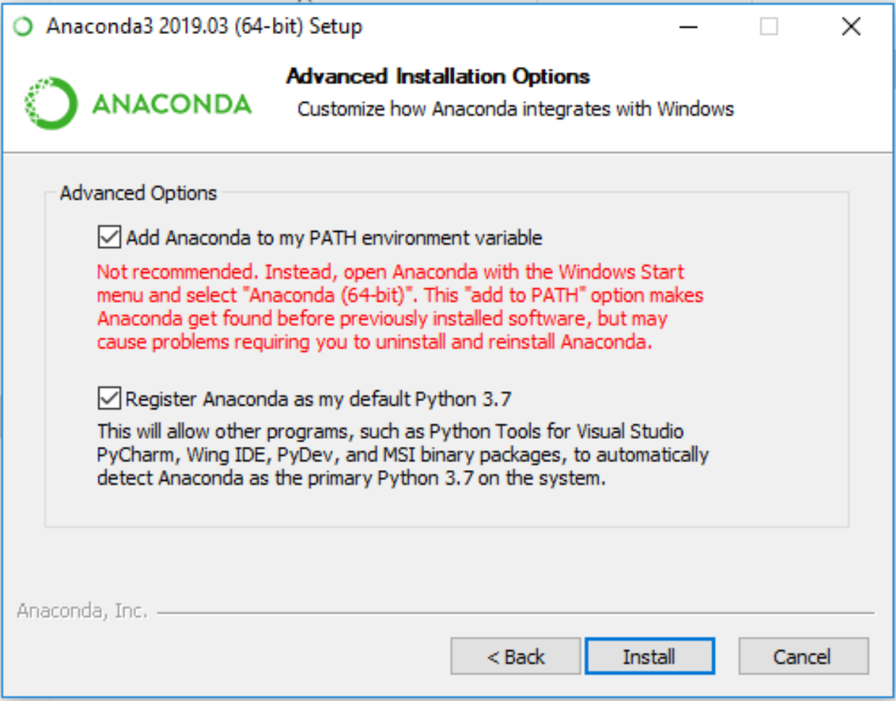

Data Analytics - Structured Data
================================

How to analyze Structured Data using Python
-------------------------------------------

---

introduction about this course

### Prerequisites

#### Theoretical things

-	Read about Mathematics & Statistics for Data Science
	- Lecture Slides :
      -	<a href="./lecture_slides/코스2_1_ML 절차 및 주요 개념.pdf">코스2_1_ML 절차 및 주요 개념.pdf</a>
      -	<a href="./lecture_slides/코스2_2_기술통계 및 그래프 분석.pdf">코스2_2_기술통계 및 그래프 분석.pdf</a>
	- Data Science School : https://datascienceschool.net/view-notebook/04358acdcf3347fc989c4cfc0ef6121c/

#### Technical things

-	Python : <a href="./prerequisites1 - python.ipynb">Prerequisite 1 - Python Notebook</a>
-	IPython & Jupyter Notebook : <a href="./prerequisites2 - python data science environment.ipynb">Prerequisite 2 - Python Data Science Environment Notebook</a>
-	NumPy : <a href="./prerequisites3 - numpy.ipynb">Prerequisite 3 - NumPy Notebook</a>
-	Pandas : <a href="./prerequisites4 - pandas.ipynb">Prerequisite 4 - Pandas Notebook</a>
-	Matplotlib : https://matplotlib.org
	- [Reference - Plots with Matplotlib](https://datascienceschool.net/view-notebook/6e71dbff254542d9b0a054a7c98b34ec/)
-	Seaborn : https://seaborn.pydata.org
	- [Reference - Visualizaiton with Seaborn](https://datascienceschool.net/view-notebook/4c2d5ff1caab4b21a708cc662137bc65/)
-	Scikit-learn : https://scikit-learn.org/stable/

### Course Details

For this project, we will use DataSets in Kaggle Competition.

---

### Getting Started

Follow the steps below!

#### Step 1: Data Analytics Workflow

General Data Analytics Workflow

#### Step 2: Regression

Boston Housing : Predicting Boston Housing Prices https://www.kaggle.com/samratp/boston-housing-prices-evaluation-validation

Ames House Prices: Advanced Regression Techniques(https://www.kaggle.com/c/house-prices-advanced-regression-techniques/overview)

#### Step 3: Classification

Titanic: Machine Learning from Disaster https://www.kaggle.com/c/titanic

#### Step 4: Clustering

Mall Customer Segmentation Data Market Basket Analysis https://www.kaggle.com/vjchoudhary7/customer-segmentation-tutorial-in-python

#### Step 5: Web Scraping

---

### Instructions for Colab Env Preparation

To setup our course environment at Colab to run the code in this repository, follow the instructions below.

1. Make your Google Account
	- https://www.google.com/

2. Downlaod course files form github repository
	- Github Repo URL : https://github.com/ttc-edu-dev-team/da-structured-data

3. Upload course files to your Google Drive
	- https://drive.google.com
	- Open Google Drive, just Drag & Drop files or directories that you want to upload.

4. Connect Google Colab App to your Google Drive
	- The code can be run through Google Drive, by installing the Google Colab app as follows.
	-	Open Google Drive, then select My Drive -> More -> Connect More Apps. Search for Colab, and then select to install.

5. Click **.ipynb** on course directory
	-	<a href="./how-to-use-colab.ipynb">how-to-use-colab.ipynb</a>


### Instructions for Python-based DA Env Preparation

To setup our course environment at local PC or Labtop to run the code in this repository, follow the instructions below.


1. Install Git
	-	Linux: https://www.atlassian.com/git/tutorials/install-git#linux
	- Mac: https://www.atlassian.com/git/tutorials/install-git#mac-os-x
	-	Windows: https://www.atlassian.com/git/tutorials/install-git#windows

2. Install Anaconda
	-	Linux: https://docs.anaconda.com/anaconda/install/linux/
	- Mac: https://docs.anaconda.com/anaconda/install/mac-os/
	-	Windows: https://docs.anaconda.com/anaconda/install/windows/
		- Anaconda for Windows 설치시 주의사항
			* 설치시 'Advanced Options' 단계에서 'Add Anaconda to my PATH environment variable' 옵션을 체크합니다.(Windows의 Default Command Prompt에서 Anaconda 명령어를 사용하기 위함입니다.)
			
3.	Downlaod repository
	- Github Repo URL : https://github.com/ttc-edu-dev-team/da-structured-data
4.	Create (and activate) a new environment with Python 3.6.
	-	Linux or Mac:
		```
		conda create --name kaggle python=3.6
		source activate kaggle
		```
	-	Windows:
		```
		conda create --name kaggle python=3.6
		activate kaggle
		```
5.	Install Python Scientific Libraries

```
pip install jupyter numpy pandas matplotlib seaborn scikit-learn scipy plotly cufflinks tqdm
```

6.	Install Etc Libraries like XGBoost, LightGBM, graphviz, python-graphviz

	-	Linux or Mac:
		```
		conda install -c conda-forge xgboost lightgbm graphviz python-graphviz
		```
	-	Windows:
		```
		conda install -c anaconda py-xgboost
		conda install -c conda-forge lightgbm graphviz python-graphviz
		```

7.	Create an IPython kernel for the kaggle environment. (Skip if you done already)

```
pip install ipykernel
python -m ipykernel install --user --name kaggle --display-name "kaggle"
```

8.	Run Jupyter Notebook

```
jupyter notebook
```

9.	Click **.ipynb** on root directory

10.	Before running code in a notebook, change the kernel to match the 'kaggle' environment by using the drop-down Kernel menu.
